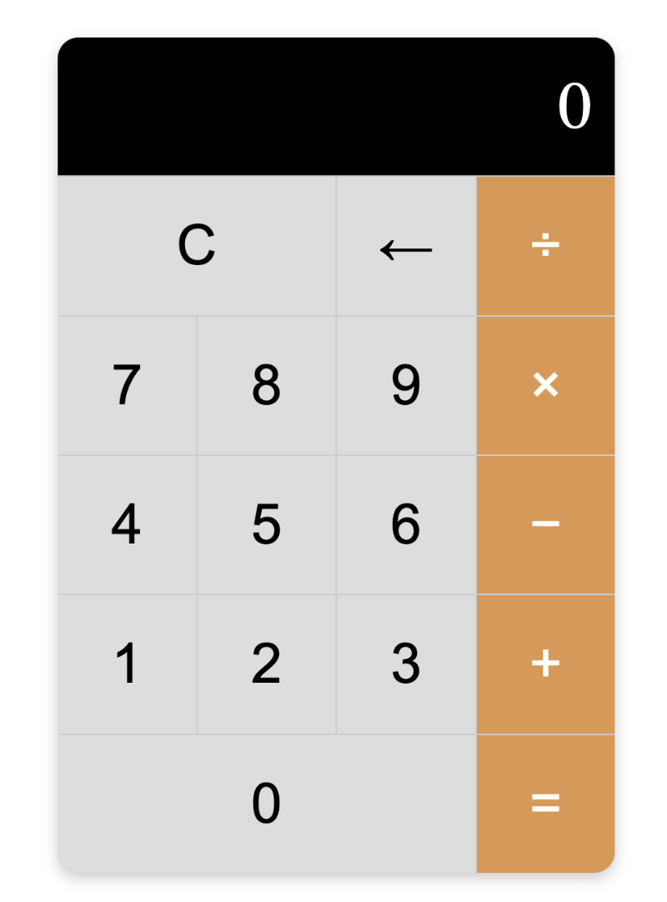

# Frontend Master Bootcamp Calculator Project

## Introduction

This project is part of the Frontend Masters Bootcamp. It focuses on creating a calculator using HTML and CSS. This is me diving back into the basics to ensure I haven't missed anything and to hone my skills. JavaScript functionality will be added in a separate lesson.



## Live Site

You can view the live version of the project [here](https://frontend-masters-calculator.netlify.app/).

## Project Structure

- **begin/**: Contains the initial setup of the project.
  - **css/**: Stylesheets with a modern design.
  - **calculator.html**: Initial HTML file.
- **end/**: Contains the final version of the project provided by the instructor.

## Features

- **HTML and CSS**: Demonstrates the use of various HTML elements and CSS properties.
- **Styling**: Custom CSS for a modern, sleek calculator design.

## Personal Learnings

While working on this project, I revisited and found several concepts interesting and important:

- **Starting from Scratch**: It was great to start from a blank state, requiring me to think about my approach.
- **Different Coding Approach**: Ended up with a coding approach very different from the instructor's, which is totally fine.
- **CSS Grid**: The biggest lesson was learning how to use CSS Grid. Aligning elements to fit the calculator layout was challenging but rewarding. The `grid-column` property and setting up the grid template correctly were key.
- **Hover and Active States**: Implemented hover and active states for better user experience (UX).

## Acknowledgements

This project is part of the Frontend Masters Bootcamp, specifically focusing on HTML and CSS lessons. Special thanks to the instructors for providing valuable lessons and resources. Learn more at [Frontend Masters Bootcamp](https://frontendmasters.com/bootcamp/).

## Getting Started

To get started with this project, clone the repository and open the `calculator.html` file in your browser.

```sh
git clone https://github.com/tak40/FM-BOOTCAMP-CALCULATOR.git
cd FM-BOOTCAMP-CALCULATOR/begin
open calculator.html
```
